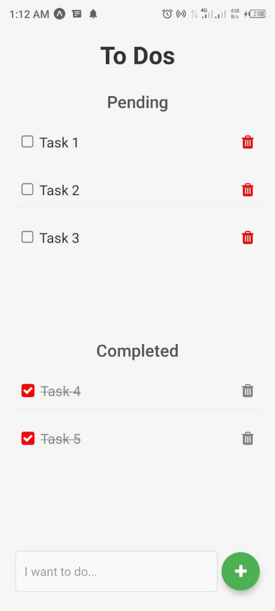

# Todo App

This is a simple to-do app built with React Native and Expo that allows users to create, mark as completed, and delete tasks. The app provides a straightforward way to manage tasks, whether for personal use or project management.



## Features
- **Create To-Dos**: Add new tasks to your to-do list.
- **Complete To-Dos**: Mark tasks as completed to track progress.
- **Delete To-Dos**: Remove tasks from the list once they’re no longer needed.

## Installation

1. **Clone the Repository:**
   ```bash
   git clone https://github.com/luwanise/todo-app.git
   cd todo-app
   ```

2. **Install Dependencies:**
   ```bash
   npm install
   ```

3. **Run the App:**
   If you have Expo CLI installed, you can run the app using:
   ```bash
   expo start
   ```

4. **Open the App:**
   - Scan the QR code in the terminal to open it on your mobile device using the Expo Go app.
   - Alternatively, run it in an Android/iOS emulator.

## Usage
- To add a task, type the task name in the input field and press "Add Task."
- To mark a task as completed, press the checkmark icon next to the task.
- To delete a task, press the trash icon next to the task.

## Credit
This app was inspired by [React Native Todo App by Dmitrii Sviridov](https://github.com/slamach/react-native-todo-app).

## Technologies Used
- **React Native**: Framework for building native apps using React.
- **Expo**: Platform to quickly run and build React Native apps.
- **React**: JavaScript library for building user interfaces.

## License
This project is licensed under the MIT License - see the [LICENSE](LICENSE) file for details.